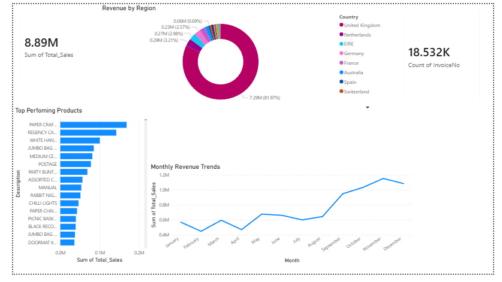

# sales-perfomance-analytics
Data cleaning and Power BI  visualization pipeline for an e commerce dataset
#  E-Commerce Sales Performance Analytics

##  Project Overview
This project was completed as part of the Future Interns Data Science & Analytics program. The objective was to analyze real world e-commerce sales data to identify key revenue drivers, top performing products, and geographical trends. 

**Tools Used:** Python (Pandas), Microsoft Power BI 

##  Data Pipeline
1. **Data Extraction & Cleaning (Python):** - Loaded raw transactional data using Pandas.
   - Handled missing Customer IDs and filtered out canceled/returned orders (negative quantities).
   - Removed administrative noise (e.g., postage, bank charges) and standardized product descriptions.
   - Engineered a `Total_Sales` feature for revenue tracking.
2. **Data Visualization (Power BI):**
   - Built an interactive executive dashboard to monitor KPIs.

##  Key Business Insights
* **Top Product:** The highest-grossing item was PAPER CRAFT LITTLE BIRDIE, generating significant revenue volume.
* **Seasonal Trends:** Sales remained steady throughout the year but experienced a massive spike in November, aligning with holiday shopping behaviors.
* **Geographic Dominance:** The vast majority of the $8.89M in total revenue was generated within United Kingdom.

##  Dashboard Preview
 
